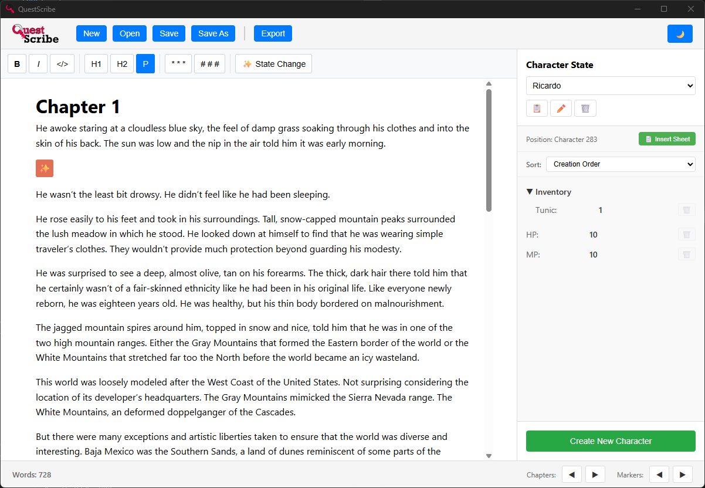
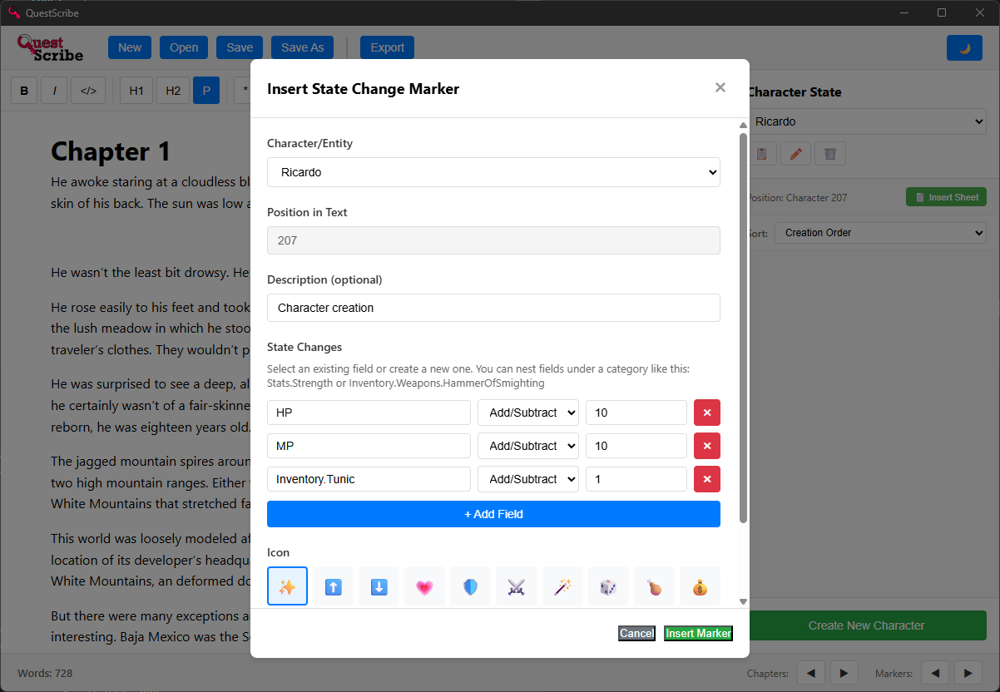
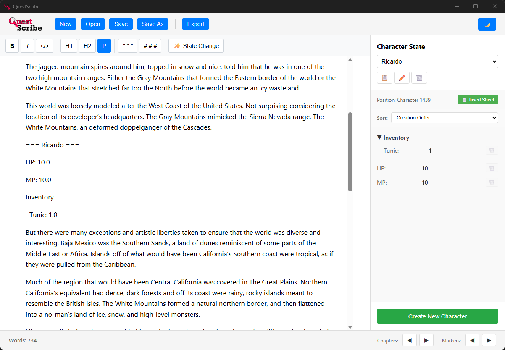

<div align="center">


# QuestScribe

### Write your story. Track your stats. Never lose continuity.

[](https://github.com/theserialhobbyist/questscribe/actions)
[](LICENSE)
[](https://github.com/theserialhobbyist/questscribe)

A specialized word processor for writing LitRPG novels with **dynamic character state tracking**.

[Features](#-features) • [Screenshots](#-screenshots) • [Installation](#-installation) • [Quick Start](#-quick-start) • [Building](#-building) • [Documentation](#-documentation)

</div>

---

## 🎮 What is QuestScribe?

QuestScribe is a desktop word processor built specifically for LitRPG authors. It lets you embed **state change markers** directly in your text to track character progression—levels, stats, items, skills—automatically calculating the current state at any point in your story.

**Never lose track of your character's HP mid-battle. Never forget which spells they've learned. Never wonder what's in their inventory.**

<div align="center">
  
  <p><i>Main editor with real-time character state tracking</i></p>
</div>

---

## ✨ Features

### 📝 **Rich Text Editing**
- Full-featured ProseMirror editor with formatting support
- Bold, italic, headings, code blocks
- Section breaks (dinkus) and chapter markers
- Keyboard shortcuts (Ctrl/Cmd + B, I, Z, etc.)
- Undo/redo support

### 🎯 **State Change Markers**
<div align="center">
  
  <p><i>Intuitive marker creation dialog</i></p>
</div>

- **Inline tracking**: Place markers directly in your text at the exact moment changes happen
- **Visual indicators**: Color-coded emoji markers (✨⬆️⬇️💗🛡️⚔️ and more)
- **Absolute & Relative changes**: Set exact values or modify existing ones
- **Nested fields**: Organize stats hierarchically (e.g., `stats.HP`, `spells.fire.Fireball`)
- **Descriptions**: Add notes like "Leveled up after boss fight"

### 📊 **Character Management**
- Track multiple characters simultaneously
- Each character has their own color for easy identification
- Duplicate characters to create templates
- Delete fields completely across all markers
- Sort fields by creation date, modification date, or alphabetically

### 🧮 **Automatic State Computation**
- Real-time state calculation at your cursor position
- Applies all markers chronologically up to current location
- Supports Add/Subtract operations (HP +10, Mana -5)
- Remove fields when items are lost or skills forgotten

### 📄 **Document Management**
<div align="center">
  
  <p><i>Insert formatted character sheets anywhere in your document</i></p>
</div>

- **Save/Load**: Native `.qsd` (QuestScribe Document) format
- **Export**: Plain text (.txt), Rich Text (.rtf), Microsoft Word (.docx)
- **Character Sheets**: Insert formatted stat sheets at cursor position
- **Navigation**: Jump between chapters and markers with keyboard shortcuts

### 🎨 **User Experience**
- **Dark mode**: Easy on the eyes for long writing sessions
- **Context menu**: Right-click for quick actions
- **Word count**: Live word count in status bar
- **Cross-platform**: Works on Windows, macOS, and Linux

---

## 📸 Screenshots

<details>
<summary><b>Click to see more screenshots</b></summary>

### Writing Interface


### State Change Marker Dialog


### Character Sheet Insertion


</details>

---

## 💾 Installation

### Download Pre-built Binaries

**Coming Soon!** Pre-built installers will be available from the [Releases](https://github.com/theserialhobbyist/questscribe/releases) page.

- **Windows**: `.exe` installer or `.msi` package
- **macOS**: `.dmg` disk image (Universal: Intel + Apple Silicon)
- **Linux**: `.deb` (Ubuntu/Debian), `.AppImage` (universal)

### Build from Source

See [Building from Source](#-building) below.

---

## 🚀 Quick Start

### Prerequisites

- **Rust**: Install from [rustup.rs](https://rustup.rs/)
- **Node.js**: Install from [nodejs.org](https://nodejs.org/) (v16 or later)
- **System Dependencies**:
  - **Windows**: Visual Studio Build Tools with "Desktop development with C++"
  - **macOS**: Xcode Command Line Tools
  - **Linux**: See [PLATFORM_COMPATIBILITY.md](PLATFORM_COMPATIBILITY.md)

### Running the Development Build

```bash
# Clone the repository
git clone https://github.com/theserialhobbyist/questscribe.git
cd questscribe

# Install dependencies
npm install

# Start development server
npm run dev
```

The first run takes several minutes to compile Rust dependencies. Subsequent runs are faster (~30 seconds).

### Using QuestScribe

1. **Create a character**: Click "Create New Character" in the sidebar
2. **Write your story**: Type in the main editor area
3. **Add state changes**: Click "✨ State Change" button or right-click in text
4. **Track progression**: Watch the sidebar update as you move your cursor
5. **Save your work**: Click "Save" to create a `.qsd` file

---

## 🔨 Building

### Option 1: Automated (Recommended) - GitHub Actions

Simply push a version tag to automatically build for all platforms:

```bash
git tag v0.1.0
git push origin v0.1.0
```

GitHub Actions will:
- ✅ Build for Windows, macOS, and Linux simultaneously
- ✅ Create installers for all platforms
- ✅ Create a GitHub Release with all artifacts

See [CICD_GUIDE.md](CICD_GUIDE.md) for detailed instructions.

### Option 2: Manual Local Build

To build locally on your current platform:

```bash
npm run build
npm run tauri build
```

**Output locations:**
- **Windows**: `src-tauri/target/release/bundle/nsis/*.exe`
- **macOS**: `src-tauri/target/release/bundle/dmg/*.dmg`
- **Linux**: `src-tauri/target/release/bundle/deb/*.deb` or `appimage/*.AppImage`

See [PLATFORM_COMPATIBILITY.md](PLATFORM_COMPATIBILITY.md) for platform-specific requirements.

---

## 📚 Documentation

- **[CICD_GUIDE.md](CICD_GUIDE.md)** - How to create automated releases with GitHub Actions
- **[PLATFORM_COMPATIBILITY.md](PLATFORM_COMPATIBILITY.md)** - Cross-platform building and compatibility
- **[CLAUDE.md](CLAUDE.md)** - Development guidance for AI assistants
- **[PROJECT_STATUS.md](PROJECT_STATUS.md)** - Current implementation status

---

## 🏗️ Architecture

QuestScribe is built with:

- **Frontend**: React + ProseMirror (rich text editing)
- **Backend**: Rust + Tauri (native desktop performance)
- **State Management**: Rust HashMap with backward-search algorithm
- **Serialization**: JSON-based document format

### Key Technologies

- [Tauri](https://tauri.app/) - Build native desktop apps with web technologies
- [ProseMirror](https://prosemirror.net/) - Extensible rich text editor
- [React](https://react.dev/) - UI component library
- [Rust](https://www.rust-lang.org/) - High-performance backend

---

## 🛣️ Roadmap

- [x] Core text editing with formatting
- [x] State change markers
- [x] Character management
- [x] Save/load documents
- [x] Export to multiple formats
- [x] Dark mode
- [x] Cross-platform builds
- [ ] **Spell checker**
- [ ] **Find/Replace**
- [ ] **Markdown export**
- [ ] **Cloud sync** (optional)
- [ ] **Collaboration features** (future)

---

## 🤝 Contributing

Contributions are welcome! Please feel free to submit a Pull Request.

1. Fork the repository
2. Create your feature branch (`git checkout -b feature/AmazingFeature`)
3. Commit your changes (`git commit -m 'Add some AmazingFeature'`)
4. Push to the branch (`git push origin feature/AmazingFeature`)
5. Open a Pull Request

---

## 📝 License

This project is licensed under the **MIT License** - see the [LICENSE](LICENSE) file for details.

**TL;DR**: You can freely use, modify, and distribute QuestScribe, even for commercial purposes. Just keep the copyright notice.

---

## 💬 Support

- **Issues**: [GitHub Issues](https://github.com/theserialhobbyist/questscribe/issues)
- **Discussions**: [GitHub Discussions](https://github.com/theserialhobbyist/questscribe/discussions)

---

## 🙏 Acknowledgments

- Built with [Tauri](https://tauri.app/)
- Editor powered by [ProseMirror](https://prosemirror.net/)
- Inspired by the LitRPG writing community

---

<div align="center">

**Made with ❤️ for LitRPG authors**

[⬆ Back to Top](#questscribe)

</div>
